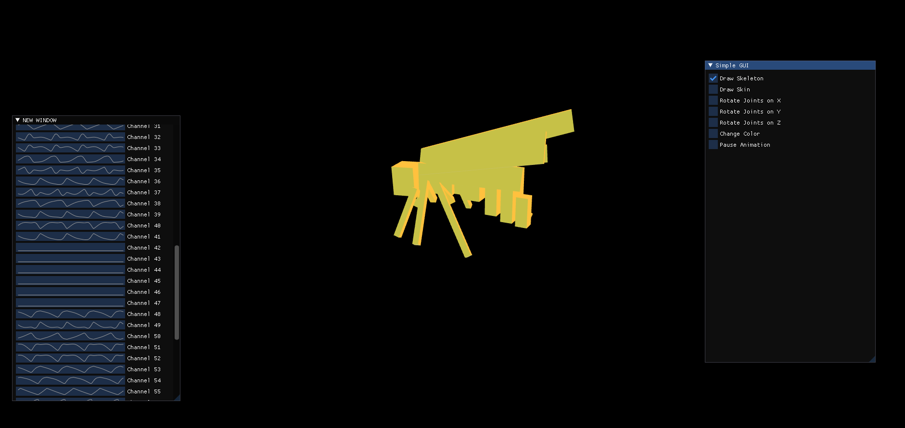
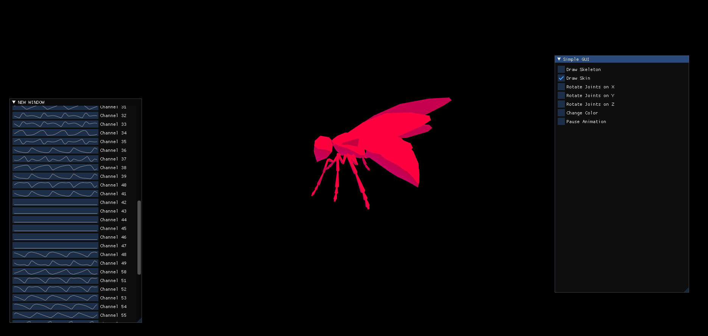
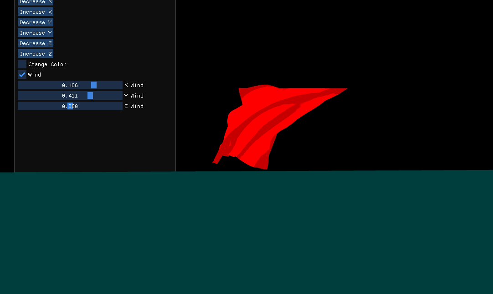
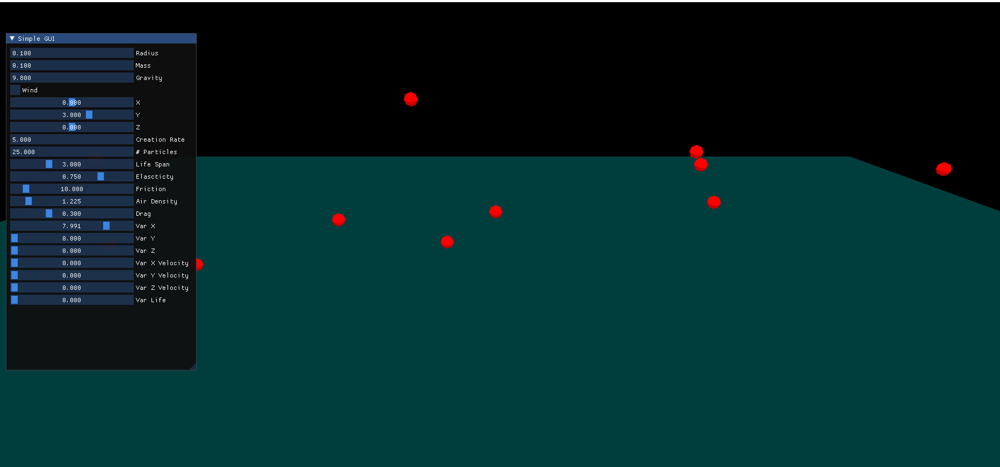

## Intro
This repo is a comination of three major projects I did in openGL. Theses three projects are loading a skeleton, skin, and animation file and processing them to work together. A cloth simualtion that has adjustable wind in the x,y, and z-axis while having forund collision. And lastly a particle simulator that has adjustable parameter on the enviornment and particle properties. All these have imgui windows I desinged myself.

## Skeleton Skin and Animation

## Cloth

## Particle Simulation
